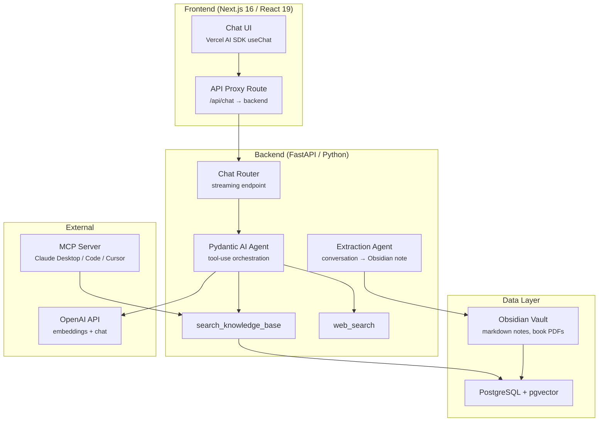
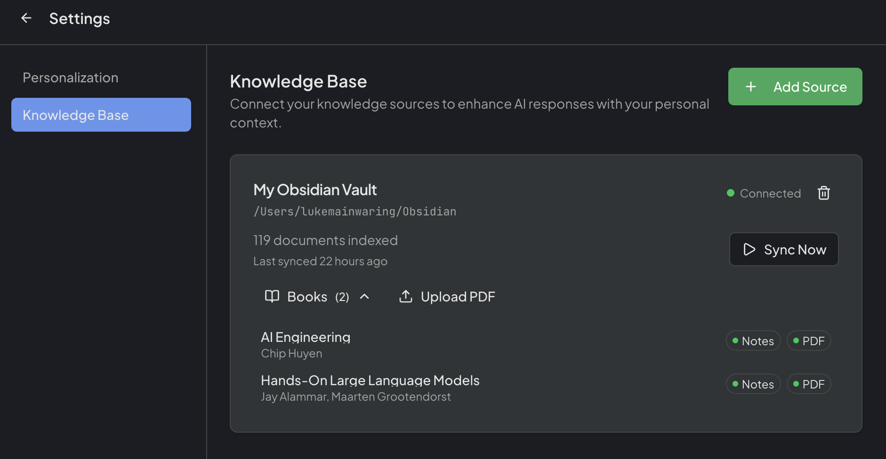

# Neurocache

An AI chat application with hybrid RAG retrieval, web search, and Obsidian integration. Chat with an AI agent that draws on your personal knowledge base — notes, books, articles — and combines it with real-time web search to give answers grounded in what you actually know.

<!-- TODO: Add hero GIF showing a chat with KB search + web search + inline citations -->
<!--  -->

## Why Neurocache?

General-purpose chatbots (ChatGPT, Claude) start every conversation from scratch. Neurocache connects to your Obsidian vault and makes your entire knowledge base searchable by an AI agent that can:

- **Retrieve from your notes** — semantic + keyword hybrid search finds relevant content even when you didn't use the exact words
- **Search the web** — supplements your knowledge with real-time information when needed
- **Cite its sources** — inline citations link back to the exact note, with Obsidian deep links
- **Extract insights back** — save conversation highlights as new notes, creating a knowledge growth loop

## Features

- **Hybrid RAG** — Semantic (pgvector cosine) + keyword (PostgreSQL full-text) search fused with Reciprocal Rank Fusion, with content-type boosting (your notes rank above raw book content)
- **Streaming chat** — Real-time responses via Vercel AI SDK with Pydantic AI agent orchestration
- **Inline citations** — Clickable `[1]` markers showing source path, content type, and similarity score; hover for preview, click for full content
- **Obsidian deep links** — Every citation path is an `obsidian://` link that opens the source note directly
- **PDF book pipeline** — Upload a book PDF → AI generates tags, summary, and key concepts → content is chunked, embedded, and searchable
- **Web search** — Agent decides when to search the web for current information
- **MCP server** — Exposes the knowledge base as MCP tools for Claude Desktop, Claude Code, and Cursor
- **Conversation-to-knowledge** — "Extract Insights" analyzes a conversation and generates a structured Obsidian note, which gets ingested back into the knowledge base
- **User personalization** — Profile context (background, interests, custom instructions) shapes how the agent responds
- **Auth0 authentication** — JWT-based auth with JWKS verification

## Architecture



**Backend** — FastAPI with async SQLAlchemy, Pydantic AI for agent orchestration, hybrid retrieval service, Alembic migrations.

**Frontend** — Next.js 16 App Router, React 19, Tailwind CSS, TanStack Query for data fetching, streaming chat via Vercel AI SDK.

**Database** — PostgreSQL 17 with pgvector for embeddings and tsvector for full-text search. Documents are chunked, embedded, and indexed during ingestion.

## Demo Workflows

These prompts showcase what Neurocache can do that generic chatbots can't. See [docs/DEMO_WORKFLOWS.md](docs/DEMO_WORKFLOWS.md) for the full list.

**Hybrid personal + web search:**
> "I've been thinking about how the Stoic concept of 'memento mori' connects to the Buddhist idea of impermanence. What have I written about either of these ideas, and how do modern psychologists frame this overlap?"

Triggers both `search_knowledge_base` (your notes on Stoicism, Buddhism) and `web_search` (current psychology research). The response synthesizes your thinking with external knowledge, citing both.

**Deep knowledge base retrieval:**
> "What have I written about [topic] and where do my ideas contradict each other?"

Retrieves relevant chunks across notes written months apart, then reasons about tensions and evolution in your thinking.

**Cross-domain connections:**
> "What connections can you find between my notes on [Topic A] and [Topic B]?"

Surfaces non-obvious links across your knowledge base using semantic search and LLM reasoning.

<!-- ## Screenshots -->

<!-- TODO: Add screenshots -->
<!-- ### Chat with Inline Citations -->
<!--  -->

<!-- ### Knowledge Base Management -->
<!--  -->

<!-- ### PDF Book Upload & Analysis -->
<!--  -->

## Quick Start

### Prerequisites

- [Docker](https://docs.docker.com/get-docker/) (for PostgreSQL + backend)
- [pnpm](https://pnpm.io/installation) (for frontend)
- [uv](https://docs.astral.sh/uv/) (for Python dependency management)
- An [OpenAI API key](https://platform.openai.com/api-keys)
- An [Auth0](https://auth0.com/) tenant (free tier works)
- An Obsidian vault with markdown notes (this is what Neurocache searches)

### Setup

1. **Configure environment:**

    ```bash
    cp .env.sample .env
    cp frontend/.env.example frontend/.env.local
    ```

    Fill in your OpenAI API key, Auth0 credentials, and Obsidian vault path in `.env`. Add your Auth0 domain and client ID to `frontend/.env.local`.

2. **Start the backend:**

    ```bash
    docker compose up -d
    ```

    This starts PostgreSQL (with pgvector) and the FastAPI backend. On first run, Alembic migrations apply automatically.

3. **Start the frontend:**

    ```bash
    pnpm -C frontend install
    pnpm -C frontend dev
    ```

4. **Open [localhost:3000](http://localhost:3000)** — sign in, connect your vault in Settings > Knowledge Base, and start chatting.

## Tech Stack

| Layer | Technology |
|-------|-----------|
| **Backend** | Python 3.13, FastAPI, Pydantic AI, SQLAlchemy (async), Alembic |
| **Frontend** | Next.js 16, React 19, TypeScript, Tailwind CSS 4, Vercel AI SDK |
| **Database** | PostgreSQL 17, pgvector, tsvector full-text search |
| **AI** | OpenAI (GPT-4o, text-embedding-3-large), Pydantic AI agents |
| **Auth** | Auth0 (JWT + JWKS verification) |
| **Infrastructure** | Docker Compose, GitHub Actions CI, pre-commit hooks |
| **Integrations** | MCP server (FastMCP), Obsidian deep links |

## Development

See [DEVELOPMENT.md](DEVELOPMENT.md) for setup, testing, linting, migrations, and API client generation.

## Roadmap

See [docs/ROADMAP.md](docs/ROADMAP.md) for planned features including temporal knowledge tracking, cross-reference discovery, and knowledge gap detection.

## License

[MIT](LICENSE)
